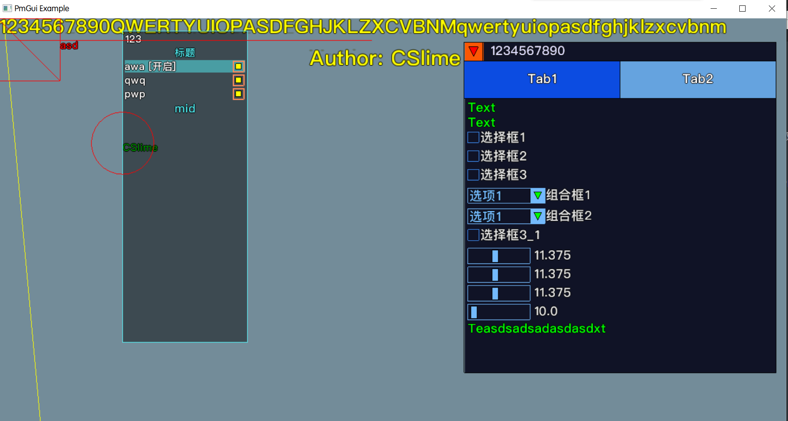

# PMGUI

## 前言

**注意: 请勿将本项目中所涉及的技术以及源码用于非法用途!**

​	自己手动从D3D11底层开始写的一个GUI,只需要提供获取鼠标坐标函数(GetCursorPos)和获取鼠标按键状态函数(GetAsyncKeyState)即可使用,支持双进程异步绘制(AsyncRenderTask)

​	几乎把我用到的所有R3的技术都放上去了,整个GUI Runtime期间全程使用syscall调用系统API,兼容性极好

## 使用方法

​	本项目使用VS2017+DirectX SDK开发,建议使用VS2017编译

- demo: PMGUI演示Demo , 使用项目配置的Release X64方案编译
- GlyphFactor: PMGUI所需字体文件的生成器 , 使用项目配置的Release X32方案编译 

## 效果

